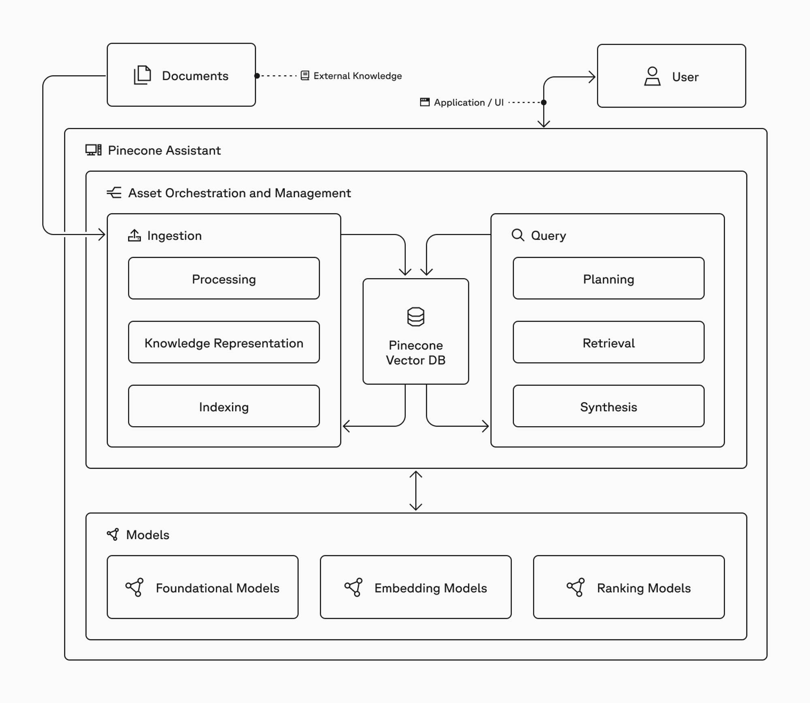

# Pinecone Assistants Sample App

This sample app connects to an existing Pinecone Assistant to expose a public or private chat interface. Users can use the chat interace to ask your assistant questions, and it will use any documents you have uploaded to it to answer the questions. 

### Built With

- Pinecone Assistant
- Next.js + Python + Tailwind 
- Node version 20 or higher

---
## Running the Sample App

### Want to move fast?

Use `npx create-pinecone-app` to adopt this project quickly.
This will clone the project, and prompt you for necessary secrets. Make sure you've created your assistant and uploaded your files in the Pinecone console at this point.

### Create a Pinecone API key
**Grab an API key [here](https://app.pinecone.io)**

Before you start, this application requires you to build Pinecone Assistant in the Console first. You'll also need to upload files to this assistant. Any set of PDF files will do!

### Environment Variables

This app uses several environment variables that need to be configured:

#### Required Environment Variables:
- `PINECONE_API_KEY`: Your Pinecone API key
- `PINECONE_ASSISTANT_NAME`: The name of your Pinecone Assistant
- `PINECONE_ASSISTANT_URL`: The URL of your Pinecone Assistant API
- `PINECONE_ASSISTANT_ID`: Your Pinecone Assistant ID

#### Optional Environment Variables:
1. `SHOW_ASSISTANT_FILES`: Set to 'true' to display the files uploaded to your Pinecone Assistant. Default is 'false'.
2. `SHOW_CITATIONS`: Set to 'true' to display citations and references in the assistant's responses. Default is 'true'.
3. `SHOW_MODELS`: Set to 'true' to display available chat models from the Pinecone API. Default is 'false'.

You can set these variables in your `.env.local` file for local development:

```
PINECONE_API_KEY=your_api_key_here
PINECONE_ASSISTANT_NAME=your_assistant_name
PINECONE_ASSISTANT_URL=https://api.pinecone.io/assistant
PINECONE_ASSISTANT_ID=your_assistant_id
SHOW_ASSISTANT_FILES=true
SHOW_CITATIONS=true
SHOW_MODELS=true
```

### Start the project

#### Dependency Installation

```bash
cd pinecone-assistant && npm install 
```
Then, start the development server: 

```bash
npm run dev
```

Visit http://localhost:3000 to access the chat interface.

## Deployment

### Deploying to Vercel

1. Push your code to a Git repository (GitHub, GitLab, or Bitbucket)
2. Connect your repository to Vercel
3. Add the required environment variables in your Vercel project settings:
   - `PINECONE_API_KEY`
   - `PINECONE_ASSISTANT_NAME`
   - `PINECONE_ASSISTANT_URL`
   - `PINECONE_ASSISTANT_ID`
4. Deploy!

### Deploying to Other Platforms

The app is configured to work with any platform that supports Next.js. Make sure to:
- Set all required environment variables
- Use Node.js 18+ 
- Run `npm install` and `npm run build`

## Project structure



---
## Troubleshooting

Experiencing any issues with the sample app?
Submit an issue, create a PR, or post in our community forum!

---